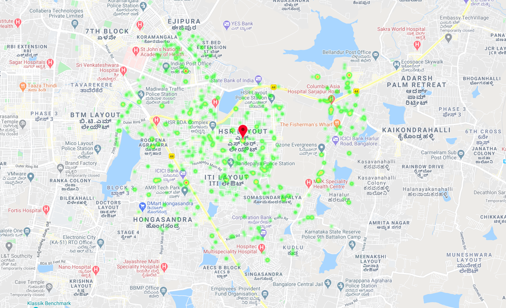
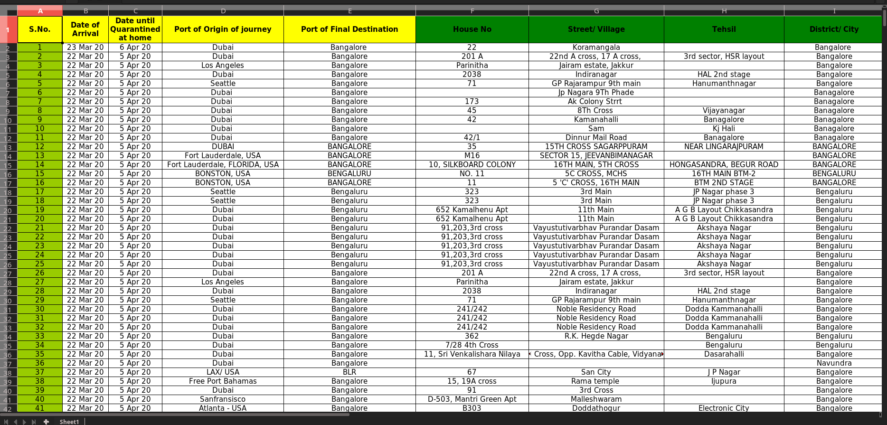

# WatchCovidly

Track the home quarantine people in 500 meter radius from the given location.





## Basic setup
  * Make a virtual environment,clone the repository and install the requirements.

  ```
  $ pip install -r requirements.txt
  ```
 * Add the *DB_STRING, GOOGLE_API_KEY, GOOGLE_MAP_URL, FILE_PATH*.
 
## Save the data from xls to database.
  
  
  * Convert *Bengaluru.xlsx* to json and save in the different file as in *bangaluru_quarantined.json* file.
  * Run the script inside the *save_data.py* file.
  * All the json data will be formatted and will be saved in the given collection.
  * Run the server.    
     
  ```
  $ python manage.py runserver
  ```
  * Open web browser and goto `127.0.0.1:8000`.
  * Search the location to see the quarantine people around that location, by
    default heatmap will show the data based on current location of the user. 

